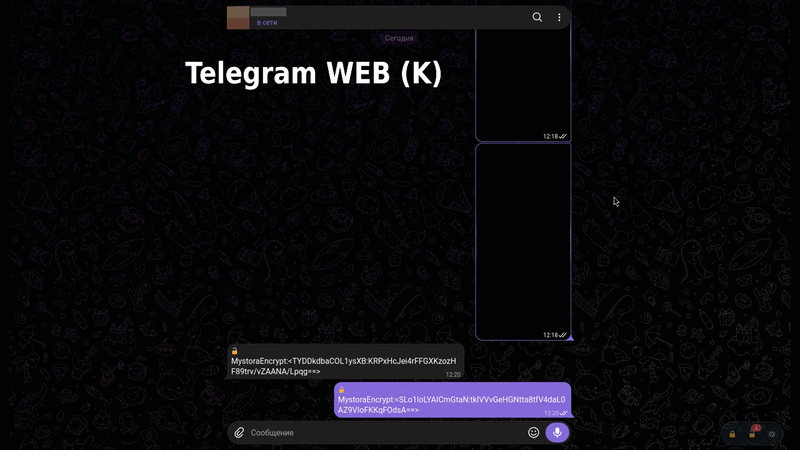

# MystoraEncrypt — локальное шифрование текста и файлов на любом сайте (Tampermonkey)

  

MystoraEncrypt — пользовательский скрипт (userscript) для локального сквозного шифрования и расшифровки текста в веб-чатах (Telegram Web, MAX, VK и любых других сайтах), а также для шифрования и расшифровки произвольных файлов. Все операции выполняются на вашем устройстве, ключи никуда не отправляются.

> **Важно:** проект предназначен только для личного использования между доверяющими друг другу людьми, которые заранее обменялись ключами. Не полагайтесь на него как на production-grade криптографию.

## Установка

1. Установите менеджер пользовательских скриптов — [Tampermonkey](https://www.tampermonkey.net/).
2. Откройте и [установите MystoraEncrypt](https://github.com/nazb1r/MystoraEncrypt/raw/refs/heads/main/MystoraEncrypt.user.js).
3. Готово — скрипт будет автоматически работать на всех сайтах.

## Основные возможности

- **Работает на любом сайте** — не привязан к конкретным мессенджерам.
- **Только локальное шифрование** — ключи хранятся только в браузере (через API `GM_setValue`), никуда не передаются.
- **Ключи по URL** — отдельный набор ключей для каждого сайта.
- **Несколько ключей собеседников на один сайт** — если переписываетесь с разными людьми (например, в разных чатах одного мессенджера), можно добавить ключ для каждого из них, с любым удобным именем; при расшифровке скрипт автоматически перебирает все известные ключи и по тому, какой из них подошёл, понимает, кто автор сообщения — вы или конкретный собеседник.
- **Ключи видны и редактируются напрямую** в панели настроек — не нужно вводить заново, если хотите что-то поправить.
- **Защищённое окно ввода** — при шифровании нового сообщения (когда поле чата пустое) открывается отдельное окно поверх страницы; набор текста в нём не попадает в поле сайта, пока вы явно не нажмёте «Зашифровать и вставить» или «Скопировать в буфер». Это важно, потому что многие чаты (включая Telegram) синхронизируют содержимое поля ввода с сервером как черновик по мере набора, ещё до отправки. Если на странице не нашлось подходящего поля ввода, окно всё равно открывается — просто кнопка вставки в нём отключена, а зашифрованный текст можно скопировать в буфер обмена и вставить вручную куда нужно.
- **Редактирование уже отправленных сообщений.** Если открыть уже отправленное сообщение на редактирование (через штатную функцию сайта) и изменить его через 🔓 → защищённое окно, панель обновит именно эту запись, сохранив её место в истории переписки.
- **Автоматическая расшифровка** входящих (и исходящих) сообщений на странице. Расшифрованный текст помечается значком 🔓, ещё зашифрованный (или не расшифровавшийся текущими ключами) — значком 🔒; по клику на 🔒 можно попробовать расшифровать ещё раз.
- **Панель расшифрованных сообщений** — оформлена как обычная переписка: свои сообщения справа, собеседника — слева, с его именем (тем самым, что указано для его ключа в настройках). Текст показывается только внутри изолированной панели самого расширения и никогда не вставляется обратно в разметку сайта. Список хранится в памяти вкладки и живёт до перезагрузки страницы; при переключении на другую переписку в том же мессенджере (SPA-навигация без перезагрузки) панель определяет это по смене адреса страницы, а если сайт не меняет адрес при переключении бесед — по тому, что вся ранее показанная лента одновременно пропала из страницы, — и обновляется автоматически в обоих случаях. Если на каком-то сайте это не сработало само — в самой панели есть кнопка «Обновить» для полного пересканирования вручную.
- **Шифрование и расшифровка файлов** (вкладка «📁 Файлы» в настройках) — любой файл, а не только текст переписки. Пароль можно задать свой или выбрать один из уже сохранённых ключей текущего сайта («Мой ключ» или ключ конкретного собеседника). Подробнее — в разделе [«Использование»](#использование) ниже.
- **Диагностика** (пункт «🩺 MystoraEncrypt: диагностика» в меню Tampermonkey) — таблица в консоли браузера (F12), показывающая по каждому найденному на странице зашифрованному сообщению его текущий статус: расшифровано / не удалось расшифровать текущими ключами / отфильтровано эвристикой «похоже на настоящую ленту» / ожидает подтверждения отправки. Полезно, если какое-то сообщение не расшифровывается, а причина не очевидна.
- **Плавающая панель** в правом нижнем углу страницы: 🔒 Зашифровать, 🔓 Расшифровать / открыть панель сообщений, ⚙ Настройки — плюс те же команды (и диагностика) доступны через меню Tampermonkey (клик по значку расширения в тулбаре браузера). Панель можно перетащить в удобное место.
- **Защищённый экспорт и импорт ключей** — резервная копия сохраняется в JSON, зашифрованном отдельным паролем.

## Использование

1. **Настройка ключей.** Откройте панель настроек (⚙ в плавающей панели или через меню Tampermonkey), вкладка «🔑 Ключи». Поле «Сайт» подставится автоматически по текущей вкладке. Введите «Ваш ключ» (или сгенерируйте кнопкой ✦) и хотя бы один ключ собеседника (с любым именем для удобства — это имя потом будет отображаться в панели расшифрованных сообщений). При необходимости добавьте ещё ключи собеседников кнопкой «+ Добавить ключ собеседника». Нажмите «Сохранить ключи».

2. **Шифрование сообщения.** Нажмите 🔒 в плавающей панели.
   - Если в поле ввода на странице уже что-то напечатано — оно тут же шифруется на месте.
   - Если поле пустое (или не найдено вовсе) — откроется защищённое окно; наберите сообщение в нём и нажмите «Зашифровать и вставить» (вставит шифротекст прямо в поле сайта) либо «Скопировать в буфер» (просто положит зашифрованный текст в буфер обмена, ничего не трогая на странице — пригодится, если поле ввода не нашлось или вы хотите вставить текст куда-то ещё). Отправляйте получившийся шифротекст как обычное сообщение.

3. **Расшифровка.** Входящие и исходящие сообщения расшифровываются автоматически и появляются в панели расшифрованных сообщений. Кнопка 🔓 в плавающей панели решает одну из двух задач в зависимости от ситуации:
   - если в поле ввода на странице уже лежит готовый зашифрованный текст (например, вы вернулись к недописанному сообщению, либо открыли уже отправленное сообщение на редактирование штатной функцией сайта) — она расшифрует его в защищённое окно для редактирования; после повторной отправки отредактированный текст займёт то же место в истории, что и раньше;
   - в остальных случаях — просто открывает панель уже расшифрованных сообщений (отдельно «пересканировать ленту» нажимать не нужно, это и так происходит в фоне).

   Значок 🔒 рядом с отдельным сообщением в чате означает, что его ещё не удалось расшифровать текущими ключами, — кликните по нему, чтобы попробовать ещё раз. Значок 🔓 — сообщение уже расшифровано; клик по нему откроет панель и подсветит именно это сообщение.

4. **Шифрование и расшифровка файлов.** Откройте панель настроек, вкладка «📁 Файлы» (или сразу через пункт «📁 MystoraEncrypt: файлы» в меню Tampermonkey).
   - Перетащите файл в область или кликните, чтобы выбрать через проводник. Скрипт сам определяет по содержимому, нужно ли его шифровать или расшифровывать — выбирать режим вручную не нужно.
   - Выберите источник пароля: «Свой пароль» (ввести вручную или сгенерировать кнопкой ✦) либо «Ключ с сайта» — выпадающий список из «Мой ключ» и всех сохранённых ключей собеседников для сайта, указанного в поле «Сайт (URL)» на вкладке «Ключи» (при необходимости смените там сайт — список обновится).
   - Нажмите «Зашифровать и скачать» / «Расшифровать и скачать». Зашифрованный файл скачивается с расширением `.mystora`; при расшифровке восстанавливаются исходное имя файла и тип — их можно передавать и хранить как обычный файл, хоть отдельно от какой-либо переписки.
   - Ограничение: браузерное API шифрования (Web Crypto) не поддерживает файлы больше ~2 ГБ за один раз — при попытке зашифровать/расшифровать больший файл скрипт покажет понятное сообщение.

5. **Экспорт/импорт ключей.** На вкладке «🔑 Ключи», в разделе «Бэкап», введите пароль резервной копии. «Экспорт» скачивает `mystora-encrypt-backup.json` с ключами, зашифрованными AES-GCM. «Импорт» расшифровывает файл тем же паролем и добавляет корректные записи к уже сохранённым.

## Технические детали

- **Шифрование текста:** AES-GCM, ключ 256 бит, случайный IV на каждое сообщение. Ключ из пароля — PBKDF2-HMAC-SHA-256, 210 000 итераций, соль `MystoraEncrypt-v1-<URL>` (то есть один и тот же пароль даёт разный реальный ключ на разных сайтах).
- **Шифрование файлов:** тот же алгоритм (AES-GCM-256, PBKDF2-HMAC-SHA-256, 210 000 итераций), но соль и IV генерируются заново для каждого файла и не привязаны к сайту — зашифрованный файл можно расшифровать тем же паролем на любой странице или вообще без открытого сайта. Имя файла, MIME-тип и размер хранятся внутри самого шифротекста (то есть тоже под защитой), а не открытым текстом в заголовке файла.
- **Хранение ключей:** через `GM_setValue`/`GM_getValue` (хранилище скрипта в Tampermonkey), только на устройстве, без дополнительного шифрования базы (кроме отдельного пароля для экспортируемой резервной копии).
- **Универсальный DOM-поиск:** поле ввода определяется по текущему сфокусированному элементу либо по самому крупному видимому редактируемому элементу на странице. Зашифрованный текст ищется обходом текстовых узлов страницы; при этом отдельно отфильтровываются одиночные вкрапления того же текста за пределами самой ленты переписки (например, превью последнего сообщения или черновика в списке чатов слева) — по структуре страницы, без привязки к именам классов или тегам конкретного сайта. Как только на странице появилось хотя бы одно уже подтверждённое сообщение (успешно расшифрованное — «якорь»), любой новый кандидат считается частью той же ленты, если ближайшие к нему несколько уровней структуры (тег и классы предков) совпадают с такими же уровнями у ЛЮБОГО из якорей, — не важно, сколько всего таких кандидатов сейчас на странице, даже один, и не важно, на какой фактической глубине вложенности он находится: разные сайты по-разному «упаковывают» каждое сообщение (у некоторых — общий неглубокий список, у других — своя многоуровневая индивидуальная обёртка на каждое сообщение), поэтому ориентир именно на структурное сходство, а не на глубину вложенности. Пока на странице ещё нет вообще ни одного подтверждённого сообщения (самая первая расшифровка после загрузки страницы) — используется оценка по самим свежим кандидатам: лента переписки почти всегда содержит несколько сообщений с общим тесным родителем, и эта группа определяется автоматически. Расшифрованный/незашифрованный текст помечается отдельным маленьким значком-элементом, вставляемым РЯДОМ с оригинальным текстовым узлом, без его замены — это сделано специально, чтобы не мешать внутренней логике сайтов, построенных на SPA-фреймворках.
- **Панель расшифрованных сообщений:** рендерится в изолированном Shadow DOM (в закрытом режиме — `mode: "closed"`); текст туда попадает в момент расшифровки и живёт только в памяти вкладки — никогда не записывается обратно в DOM сайта и не сохраняется на диск.
- **Защищённое окно ввода, панель настроек и вкладка «Файлы»:** тоже рендерятся в изолированном закрытом Shadow DOM, отдельно от разметки сайта; скрипты самого сайта не могут прочитать их содержимое.
- **Криптография:** используется только изолированный (песочный) `crypto.subtle` самого userscript-а — код никогда не исполняется в контексте страницы, сторонние библиотеки не подключаются. Это осознанный выбор в пользу безопасности: страница физически не может получить доступ к ключам или открытому тексту. Обратная сторона: на отдельных сайтах с исключительно строгими ограничениями браузера (замечено на Telegram Web (A) через Firefox) `crypto.subtle` может быть недоступен даже в изолированном контексте — в этом случае шифрование/расшифровка на таком сайте работать не будет, о чём скрипт сразу и понятно сообщит, а не будет зависать или использовать менее безопасные обходные пути.

## Известные ограничения

- **Эвристика «похоже на настоящую ленту»** (см. «Технические детали» выше) при самом первом сообщении в свежей, только что начатой переписке — когда на странице ещё вообще нет ни одного подтверждённого («якорного») сообщения — иногда не сразу отличает его от случайных вкраплений того же зашифрованного текста в других местах страницы (например, превью в сайдбаре списка чатов). Как только появляется хотя бы одно расшифрованное сообщение, эвристика дальше работает уверенно и такой проблемы уже не возникает. Если сообщение всё же не расшифровывается — воспользуйтесь диагностикой (пункт «🩺 MystoraEncrypt: диагностика» в меню Tampermonkey, см. «Устранение неполадок»): в таблице сразу видно, отфильтровано ли конкретное сообщение эвристикой или расшифровка была фактически не начата по другой причине.
- **Порядок сообщений в панели** для некоторых сайтов/раскладок может иногда быть неточным (например, сразу после переключения между переписками, до того как в текущем чате случится хотя бы одна отправка или входящее сообщение). Панель старается определить правильный порядок автоматически и подстраивается по ходу использования конкретного сайта, но не гарантирует идеальный результат на 100% сайтов — в этом случае поможет кнопка «Обновить» в самой панели или обновление страницы.
- Расширение не может защитить текст, если он был напечатан **прямо в поле ввода сайта** (а не в защищённом окне) и сайт успел сохранить его как черновик на сервере до момента шифрования.
- **Шифрование файлов ограничено ~2 ГБ** за один файл — это предел самого браузерного Web Crypto API (нет встроенной потоковой реализации AES-GCM), а не искусственное ограничение скрипта. Для больших файлов — разбейте на части перед шифрованием.

## Устранение неполадок

- **Сообщение не шифруется** — убедитесь, что для текущего сайта сохранены ключи (в панели настроек, вкладка «🔑 Ключи»). Кликните в поле ввода на странице и снова нажмите 🔒.
- **Не расшифровывается** — проверьте, что для этого сайта сохранён правильный ключ собеседника (с любым именем). Без него расшифровка невозможна. Если непонятно, в чём именно дело — откройте меню Tampermonkey → «🩺 MystoraEncrypt: диагностика»: в консоли браузера (F12 → Console) появится таблица по каждому найденному на странице зашифрованному сообщению с его статусом (расшифровано / не подошли ключи / отфильтровано как «не похоже на ленту» / ждёт отправки) — это сразу показывает, в чём проблема конкретного сообщения.
- **Расшифрованные сообщения не появляются в панели или выглядят не в том порядке** — попробуйте нажать «Обновить» внутри самой панели; если не помогло — обновите страницу целиком (см. «Известные ограничения» выше).
- **Плавающая панель не появилась** — обновите страницу; убедитесь, что скрипт включён в Tampermonkey и разрешён для этого сайта (`@match` покрывает все http/https-адреса, но Tampermonkey может спросить подтверждение для новых доменов при первом посещении).
- **Панель перекрывает что-то на странице (кнопку отправки и т.п.)** — просто перетащите её в другое место (зажать и потянуть, работает и мышью, и пальцем на сенсорном экране) — новая позиция запомнится.
- **Файл не расшифровывается на вкладке «Файлы»** — убедитесь, что указан тот же пароль, которым файл шифровался (если он выбирался как «Ключ с сайта» — тот же URL сайта и тот же ключ/собеседник). Сообщение «Не удалось расшифровать — неверный пароль или повреждённый файл» означает именно это, а не техническую неполадку.
- **«Файл слишком большой»** — Web Crypto API не поддерживает файлы больше ~2 ГБ за один раз (см. «Известные ограничения»). Разбейте файл на части.
- **«Этот сайт блокирует доступ браузерных скриптов к криптографии...»** — на некоторых сайтах с исключительно строгими ограничениями браузера (например, Telegram Web (A) через Firefox, в отличие от Telegram Web (K), где скрипт работает корректно) `crypto.subtle` недоступен даже изолированному userscript-у. В таких случаях MystoraEncrypt, по соображениям безопасности, не пытается использовать менее надёжные обходные пути — шифрование/расшифровка на таком сайте просто не будет работать, о чём и сообщает эта ошибка.

## Лицензия

MystoraEncrypt распространяется под лицензией MIT. Проект основан на [NebulaEncrypt](https://github.com/dmitrymalakhov/NebulaEncrypt) (Dmitry Malakhov, MIT). Распространяется «как есть», без каких-либо гарантий.
